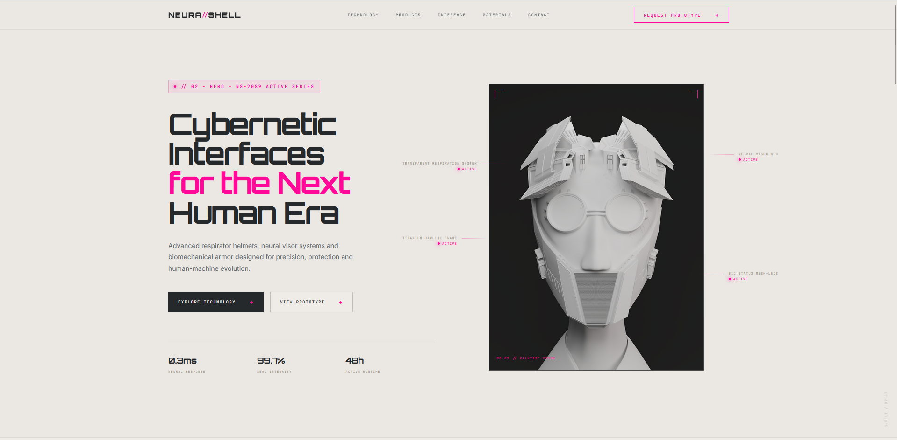

# NEURA//SHELL — Cyberpunk Landing Page

Landing page futurista desenvolvida a partir de um **design system criado com IA** e refinado no **Figma**, com foco em estética cyberpunk, interfaces tecnológicas e apresentação premium de produto.

O projeto simula uma marca fictícia chamada **NEURA//SHELL**, especializada em capacetes respiradores cibernéticos, visores neurais, armaduras biomecânicas e sistemas de interface humano-máquina.

---

## Preview



---

## Link do design no Figma

Acesse o design original no Figma:

[NEURA//SHELL — Cyberpunk Landing Page](https://www.figma.com/design/fA329wdSHpmUXvlnsJ3He4/NEURA-SHELL-%E2%80%94-Cyberpunk-Landing-Page?node-id=5-258&t=kmRG06u9O1zv1Kil-1)

---

## Sobre o projeto

Este projeto foi criado com o objetivo de transformar uma proposta visual gerada por IA em uma landing page funcional.

O fluxo utilizado até o momento foi:

1. Criação do conceito visual cyberpunk.
2. Geração de uma imagem base com estética futurista.
3. Criação de um prompt para o Figma Make.
4. Geração da landing page no Figma Make.
5. Conversão do resultado em um arquivo editável no Figma Design.
6. Criação de um design system com base no arquivo `.fig`.
7. Geração de estrutura inicial do projeto frontend.
8. Versionamento do projeto com Git e envio para o GitHub.

---

## Identidade visual

A identidade do projeto segue uma linha **cyberpunk minimalista**, com aparência de produto tecnológico premium.

Principais características visuais:

- fundo cinza claro com grade técnica;
- elementos em branco, titânio e vidro;
- acentos em rosa neon;
- pequenos indicadores vermelhos de status;
- painéis com efeito glassmorphism;
- tipografia futurista;
- cards técnicos;
- interface HUD;
- composição limpa e industrial.

---

## Seções da página

A landing page foi estruturada com as seguintes seções:

- **Header** com logo, navegação e botão de chamada;
- **Hero Section** com headline principal, imagem cibernética, CTAs e métricas;
- **Technology** com cards de recursos;
- **Products** com protótipos fictícios;
- **Interface HUD** com dados técnicos simulados;
- **Materials** com materiais futuristas;
- **Final CTA** com chamada para ação;
- **Footer** com links e informações da marca.

---

## Tecnologias utilizadas

- **React**
- **Vite**
- **JavaScript**
- **CSS**
- **Figma**
- **Figma Make**
- **Git**
- **GitHub**

---

## Estrutura do projeto

```txt
neura-shell/
├── public/
├── src/
│   ├── assets/
│   ├── components/
│   ├── styles/
│   │   ├── global.css
│   │   └── variables.css
│   ├── App.jsx
│   └── main.jsx
├── .gitignore
├── index.html
├── package.json
├── package-lock.json
├── vite.config.js
└── README.md
